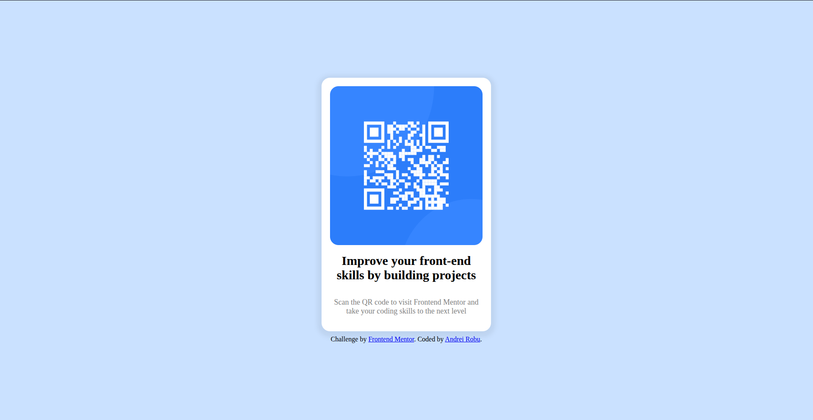

# Frontend Mentor - QR code component solution

This is a solution to the [QR code component challenge on Frontend Mentor](https://www.frontendmentor.io/challenges/qr-code-component-iux_sIO_H). Frontend Mentor challenges help you improve your coding skills by building realistic projects. 

## Table of contents

- [Overview](#overview)
  - [Screenshot](#screenshot)
  - [Links](#links)
- [My process](#my-process)
  - [Built with](#built-with)
  - [What I learned](#what-i-learned)
  - [AI Collaboration](#ai-collaboration)
- [Author](#author)

## Overview

### Screenshot

### Links

- Solution URL: [Add solution URL here](https://github.com/andreirobu-dev/qr-code-component-main)
- Live Site URL: [Add live site URL here](https://andreirobu-dev.github.io/qr-code-component-main/)

## My process

### Built with

- HTML5 markup
- CSS custom properties
- Flexbox
- Desktop-first workflow
- Mobile version

### What I learned

  First of all, this project helped me recap and reinforce basic HTML and CSS.
  Second of all, it was a good opportunity to learn new CSS proprieties like box-shadow.
  I also learned how to build more responsive websites, which are displayed differently on desktop and mobile.

### AI Collaboration

  Usually I try to limit the use of AI in my learning process, so here I only used ChatGPT to help me understand box-shadow better, and to find a specific value which I couldn't find any other way.

## Author

- Frontend Mentor - [@andreirobu-dev](https://www.frontendmentor.io/profile/andreirobu-dev)